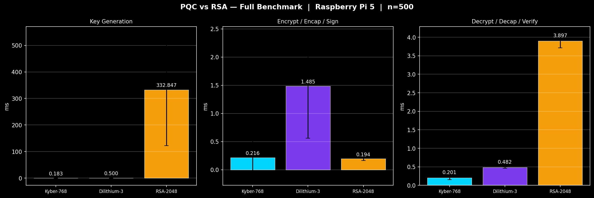
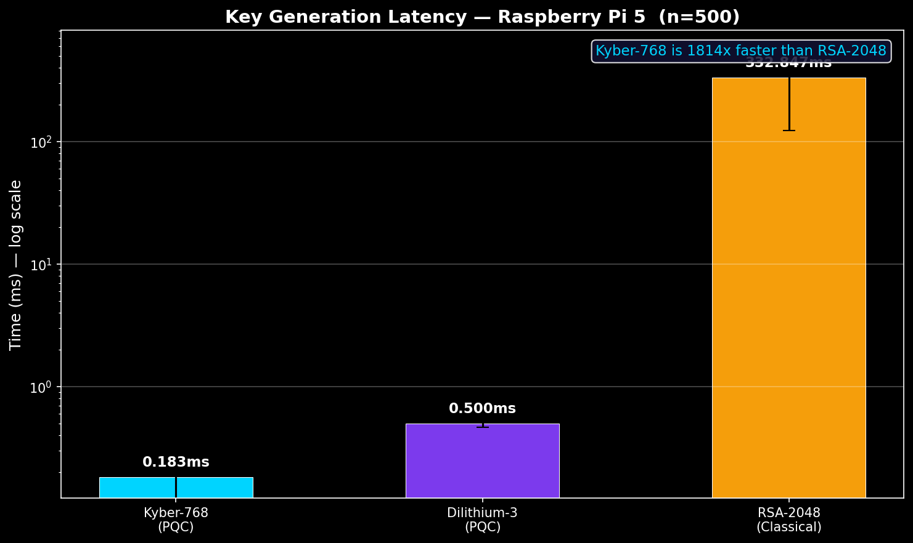
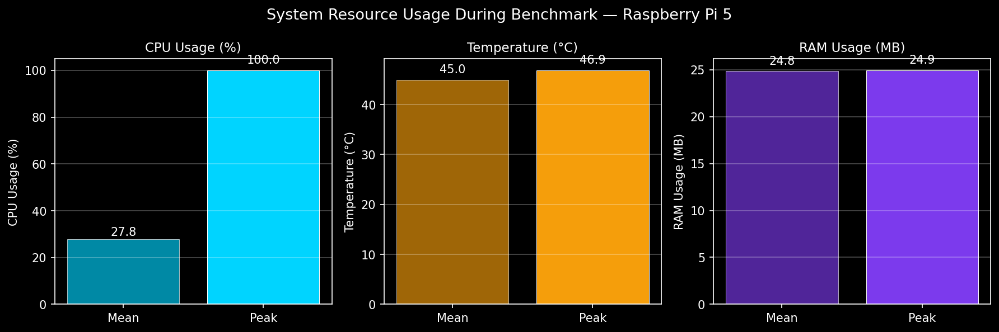
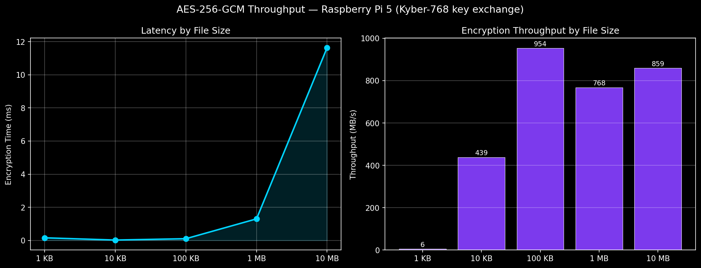

# ⚛️ QuantumVault

### Post-Quantum Cryptography Migration & Edge Infrastructure Research Platform

> 🚧 **Research Prototype — Not Production Ready**
> QuantumVault is an experimental post-quantum cryptographic benchmarking and migration-analysis platform designed for ARM edge infrastructure research.

<p align="center">
  
  
  
  
</p>

---

# 📌 Overview

QuantumVault explores the feasibility of deploying **NIST-standardized post-quantum cryptographic algorithms** on constrained ARM edge systems such as the Raspberry Pi 5.

The project focuses on:

* 🔐 Hybrid PQC encryption workflows
* 📊 ARM edge benchmarking
* 🏦 Cryptographic migration simulation for financial infrastructure
* 📦 CBOM (Cryptography Bill of Materials) analysis
* ⚡ Crypto-agility experimentation
* 📈 Statistical performance characterization

---

# 🇮🇳 Motivation — RBI Q-SAFE Alignment

In 2025, the Reserve Bank of India (RBI) constituted the **Q-SAFE Expert Committee** to evaluate:

* Quantum-safe cryptography migration
* Financial cryptographic inventory (CBOM)
* Crypto-agility readiness
* Deployment feasibility
* Infrastructure modernization pathways

QuantumVault is a student-led experimental platform exploring whether modern post-quantum cryptographic systems can realistically operate on commodity ARM edge hardware relevant to:

* ATM nodes
* Banking edge infrastructure
* Distributed authentication systems
* Secure embedded financial endpoints

---

# 🏗️ Cryptographic Architecture

```text
User File
    │
    ▼
AES-256-GCM Encryption
    │
    ▼
Kyber-768 Encapsulation
    │
    ▼
Dilithium-3 Digital Signature
    │
    ▼
.qvault Secure Container
```

### Secure Container Structure

```text
.qvault = {
    Magic Header,
    Kyber Capsule,
    Nonce,
    Dilithium Signature,
    AES-GCM Ciphertext
}
```

### Decryption Workflow

```text
Verify Signature
      ↓
Decapsulate Kyber Capsule
      ↓
Recover AES Session Key
      ↓
Decrypt Ciphertext
```

---

# 🧪 Benchmark Methodology

Benchmarks were executed on:

| Hardware       | Specification                     |
| -------------- | --------------------------------- |
| Raspberry Pi 5 | 8GB ARM Cortex-A76                |
| OS             | Raspberry Pi OS (armhf userspace) |
| Python         | 3.11                              |
| Benchmark Runs | 1000 iterations                   |
| Conditions     | Sequential single-threaded        |

---

# 📊 Benchmark Visualizations

## 🔹 Full PQC vs RSA Benchmark

<p align="center">
  
</p>

---

## 🔹 Key Generation Latency (Log Scale)

<p align="center">
  
</p>

---

## 🔹 System Resource Usage During Benchmarking

<p align="center">
  
</p>

---

## 🔹 AES-256-GCM Throughput Scaling

<p align="center">
  
</p>

---
### Statistical Analysis

* ✅ Mean latency
* ✅ 95% confidence intervals
* ✅ Throughput analysis
* ✅ CPU utilization
* ✅ Thermal measurements
* ✅ Repeated-trial characterization

---

# 📊 Benchmark Results

| Operation        | Kyber-768 | Dilithium-3 | RSA-2048 |
| ---------------- | --------- | ----------- | -------- |
| Key Generation   | ~0.18ms   | ~0.49ms     | ~332ms   |
| Encrypt / Sign   | ~0.20ms   | ~1.49ms     | ~0.19ms  |
| Decrypt / Verify | ~0.20ms   | ~0.48ms     | ~3.89ms  |
| CPU Peak         | 42.5%     | —           | 100%     |
| Thermal Peak     | 44.6°C    | —           | 46.9°C   |

> ⚠️ Results are platform-specific and workload-dependent.
> PQC and RSA algorithms differ in bandwidth, signature size, and deployment characteristics.

---

# 🚀 Throughput Performance

| File Size | Encrypt Time | Decrypt Time | Throughput |
| --------- | ------------ | ------------ | ---------- |
| 1 KB      | 0.16ms       | 0.01ms       | 6.3 MB/s   |
| 10 KB     | 0.02ms       | 0.02ms       | 438.7 MB/s |
| 100 KB    | 0.10ms       | 0.11ms       | 953.8 MB/s |
| 1 MB      | 1.30ms       | 1.31ms       | 768.2 MB/s |
| 10 MB     | 11.64ms      | 11.82ms      | 859.2 MB/s |

---

# 🏦 CBOM Simulation Layer

QuantumVault includes an experimental **Cryptography Bill of Materials (CBOM)** simulation aligned with RBI Q-SAFE migration concepts.

### Simulated Infrastructure Components

* 🏧 ATM Network Nodes
* 🔒 Core Banking TLS
* 📱 Mobile Banking Authentication
* 🧾 Audit Log Integrity
* 💳 Inter-bank Settlement Systems
* ✍️ Secure Document Signing Pipelines

---

# 📂 Repository Structure

```text
/core               Core cryptographic engine
/benchmarks         Statistical benchmark suites
/results            JSON benchmark outputs
/plots              Generated benchmark visualizations
/tests              Failure-mode & validation tests
/docs               Technical documentation
/security_notes     Threat models & limitations
```

---

# 🔑 Core Features

* ✅ Kyber-768 key encapsulation
* ✅ Dilithium-3 digital signatures
* ✅ AES-256-GCM authenticated encryption
* ✅ Hybrid PQC encryption workflow
* ✅ Secure `.qvault` container format
* ✅ ARM edge benchmarking suite
* ✅ Statistical benchmark framework
* ✅ CBOM-oriented migration analysis
* ✅ RSA → PQC migration experimentation
* ✅ Automated benchmark plot generation

---

# ⚠️ Security Notes

QuantumVault is an **experimental research platform**.

Current implementation does **NOT** yet address:

* Side-channel resistance
* Hardware fault attacks
* Secure enclave integration
* Enterprise key management
* Formal cryptographic audits
* Production deployment hardening

See:

* `security_notes/LIMITATIONS.md`
* `security_notes/THREAT_MODEL.md`

---

# 🔬 Future Work

## ARM + GPU Expansion

* NVIDIA Jetson Orin Nano benchmarking
* GPU-assisted cryptographic acceleration
* Concurrent workload scaling

## Edge Infrastructure Research

* Secure transaction simulation
* Crypto-agility orchestration
* Hybrid RSA + PQC workflows

## Systems Characterization

* Thermal profiling
* Power analysis
* Sustained-load testing
* Extended failure-mode analysis

---

# 📈 Research Direction

QuantumVault is evolving toward:

> Experimental Post-Quantum Secure Edge Infrastructure Benchmarking & Migration Research

with focus on:

* Embedded security systems
* ARM edge infrastructure
* Banking migration feasibility
* Crypto-agility analysis
* Accelerated cryptographic workloads

---

# 📜 Disclaimer

QuantumVault is intended for:

* Research
* Benchmarking
* Educational experimentation
* Infrastructure migration analysis

It is **NOT production-ready banking software** and must not be deployed in real financial environments without formal security review and cryptographic audit.

---

# Acknowledgements

The HPC benchmarking component of QuantumVault was conducted using the PARAM Rudra High Performance Computing facility at the Inter-University Accelerator Centre (IUAC), New Delhi.

The author gratefully acknowledges the Director of IUAC and the PARAM Rudra HPC team for providing access to the national HPC infrastructure and for their technical support during this research.

# 👨‍💻 Author

**Varun Tej M**
B.Tech CSE (IoT) — Malla Reddy University
Research Interests:

* Post-Quantum Cryptography
* Edge Infrastructure
* Quantum Systems
* Secure Embedded Computing
* Accelerated Computing

---

⭐ If you found this project interesting, consider starring the repository.
